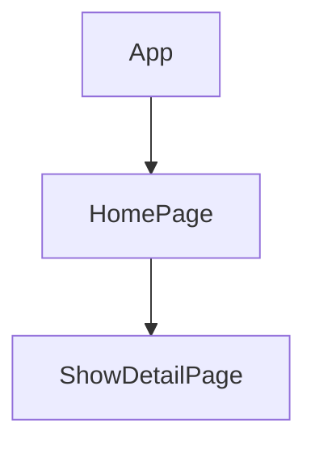

> 💻 PROJECT NAME ✨ => 💻  metta-pro
> 
 

## 🔗 Profile Links✨

| Resume | Github                                                                                                                                   | Linkedin                                                                                                                                                            | Portfolio                                                                                                                                    | Blogger                                                                                                                                                           | Medium                                                                                                                                    |
| ------------- | ---------------------------------------------------------------------------------------------------------------------------------------- | ------------------------------------------------------------------------------------------------------------------------------------------------------------------- | -------------------------------------------------------------------------------------------------------------------------------------------- | -------------------------------------------------------------------------------------------------------------------------------------------- | -------------------------------------------------------------------------------------------------------------------------------------------- |
|  | |  | | | |  

## 💫Tech-Stack->

- #### For Frontend:-
   - `HTML5`
  - `CSS3`
  - `JavaScript `
  - `ReactJS`
 
- #### For Styling:-  
   - `Tailwind css `
  
- #### For live Project: -
   - `Vercel`
   

## ⭕Steps to run our project:

✨Clone the repository.

✨Run the command `npm install` in both the frontend and backend folders.

✨Run the command `npm start` in the frontend folder on localhost:3000.

---
## Features ✨:-
---
 | Serial No            | Feature                                                              |
| ----------------- | ------------------------
| 1 | Search for countries based on currency and name|
| 2 |Displays country information including image name and capital |
| 3 | show details, popup data list  |
| 4 | User can use the enter or search button to get the data|
| 5 | Error and loading implemented  |
| 6 | Very good UI and responsive design 

---
# Package.json(Dependency)✨:-

 | Serial No  | Frontend |
| -----------------|-----|
| 1 | Tailwind css |
| 2 |  React  |

⭕Steps to use our project:
---
## Currency to Country Search Web App:-
Discover countries associated with specific currencies using our intuitive Currency to Country Search Web App.
Explore and discover countries associated with specific currencies with our Currency to Country Search Web App. This user-friendly application allows you to seamlessly search for information about countries using either a currency code or name. Designed with simplicity and functionality in mind, it provides a visually appealing interface to access relevant details about countries worldwide.

# 🚀 Getting Started

## ✨Step 1 - 💫Clone the Repository: Use the provided repository URL to clone the project to your local machine.

## ✨Step 2 -💫Navigate to the Project Directory: Move into the project directory created during cloning.

## ✨Step 3 -💫Install Dependencies: Run npm install to install the project dependencies.

## ✨Step 4 -💫Start the Development Server: Launch the development server with npm start and access the app in your web browser at http://localhost:3000.

## ✨Step 5 - Enter Currency Code or Name:
You will see a search bar where you can enter a currency code (e.g., SEK) or a currency name (e.g., Euro).

## ✨Step 6- Perform the Search:
Press the "Search🔍" button or hit Enter to retrieve information about the countries associated with the provided currency.

## ✨Step 7 - Explore Country Information:
Explore the country information displayed in a visually appealing grid format with details such as country name, capital, region, and population.

## ✨Step 8 - Show More Details:
Click on the "Show More Details" button to view additional information about the selected country, including official name, currency details, and flag/maps.

## ✨Step 9 - Search Again:
Perform multiple searches by entering different currency codes or names and repeating the process.

---
# 🧑‍💻Implemented 
🔍Search by Currency Code or Name: Enter a currency code (e.g., SEK) or a currency name (e.g., Euro) to find countries associated with that currency.

💻Intuitive User Interface: A straightforward and clean UI makes it easy for users to navigate and perform searches effortlessly.

🎛️Visual Grid Display: Country information is presented in a grid format with essential details such as country name, capital, region, and population.

🏳️Additional Country Details: Explore more about a selected country by clicking on the "Show More Details" button. Access information like the official name, currency details, and view the country's flag and maps.

🧑‍🏫Responsive Design: The web app is designed to provide an optimal viewing experience across various devices, ensuring accessibility for a broader audience.

---

# 🛠️ Technologies Used For:- 
⭕React: The project is built using the React JavaScript library, ensuring a modular and efficient front-end development experience.

⭕Tailwind CSS: Utilizing the utility-first CSS framework for styling, the app achieves a sleek and responsive design.

⭕REST Countries API: The application fetches country-related data using the REST Countries API, making real-time information retrieval possible.

---

## Flow

# 🌍 Future Enhancements

🌐Currency Conversion: Implement a feature to convert currency values based on real-time exchange rates.

🌐User Authentication: Allow users to save preferences and access personalized features.

🌐Localization: Support multiple languages for a more inclusive user experience.

---

<h1 align="center">✨Thank You✨</h1>

